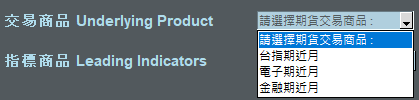

&nbsp;  &nbsp;  &nbsp;  &nbsp;  &nbsp;  &nbsp;   &nbsp;   &nbsp;  &nbsp;  &nbsp;  &nbsp;  &nbsp; &nbsp;   

&nbsp; 
# &nbsp;  &nbsp;  &nbsp; &nbsp;  &nbsp;  &nbsp;   &nbsp;   &nbsp;  $ $ $ &nbsp;   **期貨多空趨勢預測**  &nbsp; $ $ $
  &nbsp; 

## 這是一個預測期貨走勢的工具

### 資料由2010年開始至今
&nbsp; 
***

### 投資都有風險，交易前請詳閱公開說明書!!!

***
&nbsp; 
&nbsp; 

## **操作步驟**

## 1. 從下拉式選單選擇您想要交易的期貨商品

&nbsp; 

## 2. 填入您所想要當作指標商品的股票代號

&nbsp; 

## 3. 填入您希望交易的期貨口數

***

&nbsp; 
&nbsp; 

## **協助工具**

### -若不確定股票代號，可按下視窗中央的 [查詢股票代號]，依代碼或名稱查詢。
### -代碼和名稱不需輸入完整即可查詢

&nbsp;

## **選擇性輸入**

### 每個股票的權重預設為1，可調整為其他正整數

***

&nbsp;
&nbsp;

## 按下 **開始計算** 顯示結果
&emsp;

&emsp;
## **中間欄位:** 
- ### 漲跌幅相關係數
- ### 所需初始資金
- ### 年化報酬(金額)
- ### 年化報酬率
- ### 最新交易資料接收時間
- ##  **今日應持有部位**
- ### 昨日應持有部位

&emsp;
## **右邊圖片:**
- ### 上圖是期貨商品和指標商品的價格走勢圖
- ### 下圖是2010年以來以此指標交易的年損益圖

&emsp;
***

&emsp;
&emsp;

## **Authors**

# [**Yifan Lai**](https://github.com/Yifanaxan)

## **Acknowledgments**

* ### Hat tip to anyone whose code was used
* ### ChatGPT
* ### etc...
